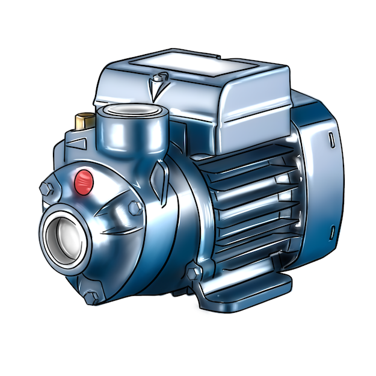
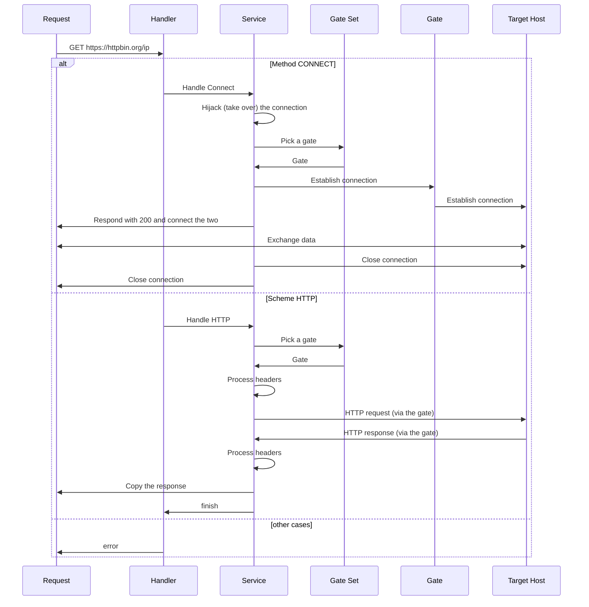
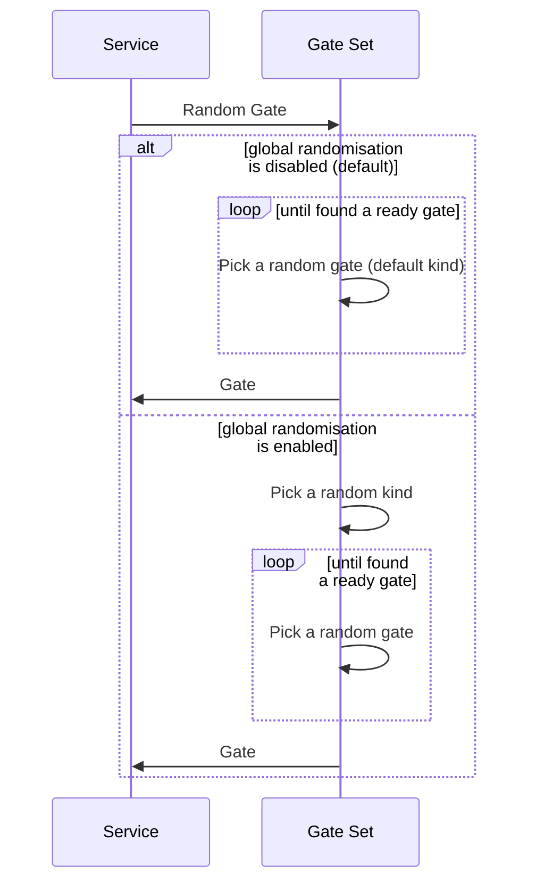
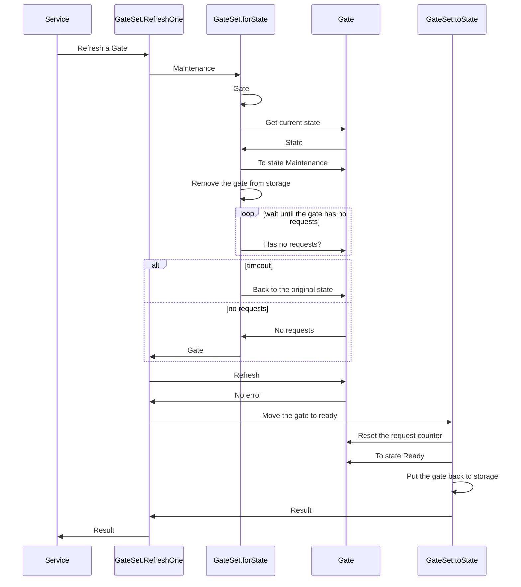
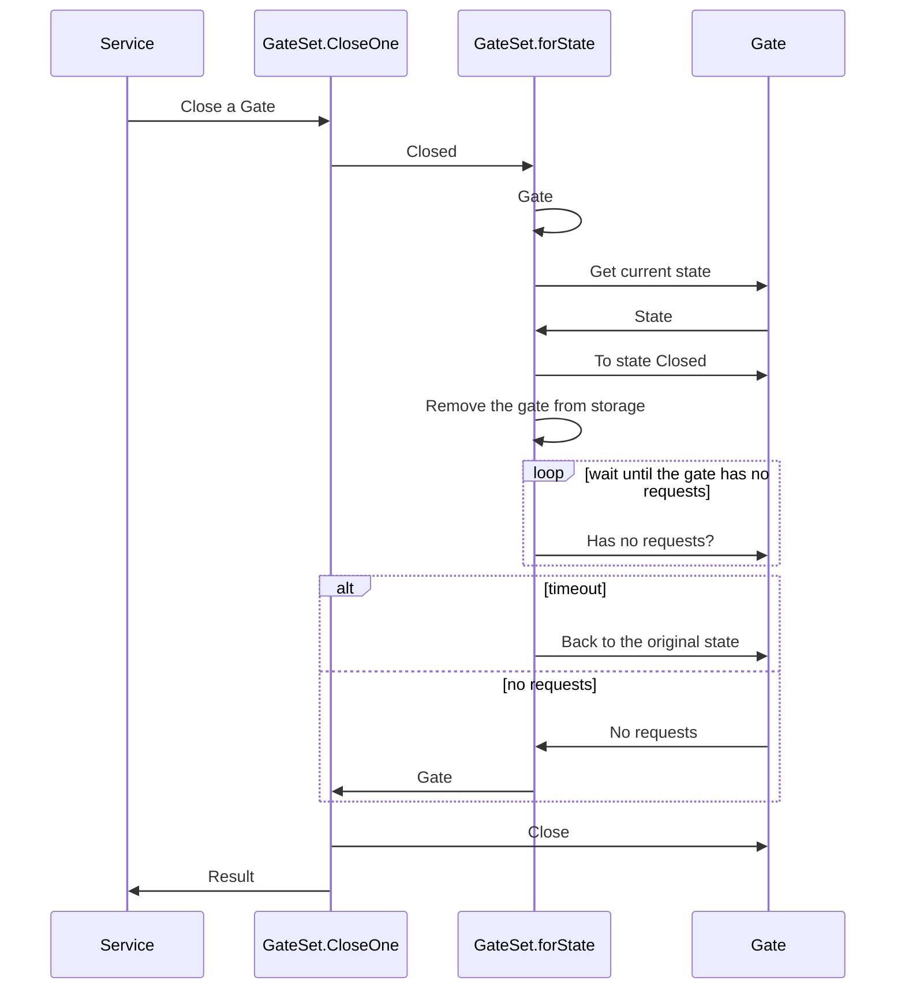

<h1>
    <p align="center">
        
        <br>Pumpe
    </p>
</h1>
<p align="center">
    A forward proxy service with support for Tor and WireGuard.
    <br/>
    <a href="#about">About</a> ·
    <a href="#configuration">Configuration</a> ·
    <a href="#modes">Modes</a> ·
    <a href="#interacting-with-pumpe">Interacting with Pumpe</a> ·
    <a href="#ventil">Configuring a client</a> ·
    <a href="#internals">Internals</a>
</p>


## About

Pumpe is a forward proxy that supports Tor and WireGuard, allows managing its gates at runtime, and offers a degree of customisation on the client.

Tor exit gates can be created at startup and/or at runtime via [the API](#proxy).

WireGuard exit gates can only be created at startup, based on the configuration files located in a directory specified as `PUMPE_WG_DIR`.

Once started, Pumpe will proxy incoming requests via the `PUMPE_DEFAULT_KIND` kind of exit gates. For instance, if started with `PUMPE_TOR_NUM=4` and `PUMPE_DEFAULT_KIND=tor`, Pumpe will pseudo-randomly choose a Tor gate for each incoming request. Further customisation is possible, see [Interacting With Pumpe](#interacting-with-pumpe) and [Ventil](#ventil).


## Running

### Docker

While in the project root directory:

```bash
docker compose up pumpe
```


### Locally

Pumpe can also be run locally, though you're responsible for setting up the host. Specifically, if Tor functionality is needed, the [Tor binary](https://www.torproject.org/download/tor/) must be available in `$PATH`. Make sure to have this installed.

To run it, from the project root directory:

```bash
mkdir -p bin
go build -o bin/pumpe ./cmd/pumpe
PUMPE_LOG_LEVEL=DEBUG PUMPE_WG_DIR=./wg PUMPE_NUM_TOR=1 ./bin/pumpe
```


## Configuration

Pumpe is configured via environment variables. It comes with reasonable defaults.

There is only one mandatory setting that must be specified, `PUMPE_WG_DIR`, and it must be a path an **existing** directory. The directory **can be empty**, but it must exist. When run via `docker compose`, Pumpe defaults to `./wg`.

Below is a list of all environment variables and their respective defaults:

| Name | Value | Description |
| --- | --- | --- |
| `PUMPE_PORT` | `8080` | The port Pumpe should listen on. |
| `PUMPE_LOG_LEVEL` | `INFO` | The level for logging. |
| `PUMPE_LOG_FORMAT` | `json` | The logging format. |
| `PUMPE_DEFAULT_KIND` | `tor` | The default type of gates for rotation. |
| `PUMPE_WG_DIR` | `""` | The directory to search WireGuards configs in. |
| `PUMPE_WG_PARSE_MODE` | `0` | The parsing mode for WireGuard configuration files: <ul><li>`0` -> report errors encountered during parsing (log at `Warn` level), don't fail;</li><li>`1` -> stop at the first encountered parsing error;</li><li>`2` -> ignore parsing errors (no reporting).</li></ul> |
| `PUMPE_WG_DNS` | `9.9.9.9` | The DNS server to use with WireGuard. |
| `PUMPE_TOR_NUM` | `4` | The number of Tor gates to start on startup. |
| `PUMPE_TOR_MAX` | `128` | The maximim number of Tor gates that can exist simultaneously. |
| `PUMPE_TOR_STARTUP_TIMEOUT` | `3m` | The timeout given to a Tor gate to start. |
| `PUMPE_SHUTDOWN_TIMEOUT` | `30s` | The timeout given to the service to shutdown gracefully. |
| `PUMPE_HTTP_CLIENT_TIMEOUT` | `60s` | The HTTP client timeout. |
| `PUMPE_SET_RANDOM_LOOP_TIMEOUT` | `30s` | The timeout for finding a random ready gate. |
| `PUMPE_SET_RANDOM_LOOP_DELAY` | `10ms` | The polling interval for a random ready gate. |
| `PUMPE_SET_STATE_LOOP_TIMEOUT` | `30s` | The timeout for a gate to become free of requests. |
| `PUMPE_SET_STATE_LOOP_DELAY` | `10ms` | The polling interval for a gate to become free of requests. |
| `PUMPE_LOG_ADD_SOURCE` | `false` | Add the file path and line number where a log message occured. |
| `PUMPE_RANDOMISE_KINDS` | `false` | Randomise between Tor and WireGuard. |


### Notes on WireGuard

Pumpe reads `PUMPE_WG_DIR` only once at startup. Ideally, the directory must contain only valid WireGuard client configuration files. File parsing has a few modes, controlled via `PUMPE_WG_PARSE_MODE` (see the table above). By default Pumpe will report any errors associated with parsing, and continue.

Pumpe does not watch the directory for new WireGuard files. The current API does not allow creating new WireGuard gates (though stopping a running gate is possible via the API).

> [!NOTE]
> Pumpe ignores the `DNS` fields in WireGuard client configuration files. This is because, during testing, it's been shown that many WireGuard servers "misbehaved" when a connection was configured with the supplied `DNS`. Use `PUMPE_WG_DNS` instead.


## Modes

Pumpe has a few modes. This is what they do and how can be configured:
- Regular:
    - a mode with a few Tor and WireGuard gates, with Tor being the default for randomisation;
    - `PUMPE_TOR_NUM` > (is greater than) `0`;
    - `PUMPE_WG_DIR` set to a non-empty directory with valid WireGuard configs;
- Tor-only:
    - a mode with a few Tor gates and no WireGuard;
    - `PUMPE_TOR_NUM` > `0`;
    - `PUMPE_WG_DIR` set to an empty directory;
- WireGuard-only on start, Tor can be added later:
    - a mode with only WireGuard at the start;
    - Tor gates can be started later if desired;
    - `PUMPE_TOR_NUM=0`;
    - `PUMPE_DEFAULT_KIND=wireguard`;
- Direct-only on start, Tor can be added later:
    - a mode with only the local client available at startup;
    - Tor gates can be started later if desired;
    - `PUMPE_TOR_NUM=0`;
    - `PUMPE_DEFAULT_KIND=direct`;
- Randomising between Tor and WireGuard:
    - a mode similar to Regular, but pseudo-randomly alternating between Tor and WireGuard gates;
    - `PUMPE_TOR_NUM` > `0`;
    - `PUMPE_WG_DIR` set to a non-empty directory with valid WireGuard configs;
    - `PUMPE_RANDOMISE_KINDS=true`.


## Interacting with Pumpe

Using Pumpe as a proxy and managing it via the API is possible with cURL.


### Using the Proxy

- A regular request via a random gate of the default kind:

```bash
https_proxy=127.0.0.1:8080 curl 'https://httpbin.org/ip'
```

- A request via a random Tor gate:

```bash
https_proxy=127.0.0.1:8080 curl --proxy-header "Proxy-Pumpe-Gate-Type: tor" 'https://httpbin.org/ip'
```

- A request via a random WireGuard gate:

```bash
https_proxy=127.0.0.1:8080 curl --proxy-header "Proxy-Pumpe-Gate-Type: wireguard" 'https://httpbin.org/ip'
```

- A request via the direct gate (local client):

```bash
https_proxy=127.0.0.1:8080 curl --proxy-header "Proxy-Pumpe-Gate-Type: direct" 'https://httpbin.org/ip'
```

- A request via a specific gate by ID:

```
https_proxy=127.0.0.1:8080 curl --proxy-header "Proxy-Pumpe-Gate-Id: facade00-0000-4000-a000-000000000000" 'https://httpbin.org/ip'
```


### Using the API

- Listing all gates:

```bash
curl -X GET 'http://127.0.0.1:8080/v1/_service/gates'
```

- Creating a new Tor gate:

```bash
curl -X POST 'http://127.0.0.1:8080/v1/_service/gates' -d '{"kind": "tor"}'
```

- Refreshing an existing Tor gate:

```bash
curl -X PATCH 'http://127.0.0.1:8080/v1/_service/gates/9dc56c47-0d06-45a7-a263-d63e1ff86762'
```

- Stopping an existing Tor or WireGuard gate:

```bash
curl -X DELETE 'http://127.0.0.1:8080/v1/_service/gates/ba1106ee-adda-42c9-b42f-c90a2ab7e2af'
```

- A simple health check:

```bash
curl -X GET 'http://127.0.0.1:8080/v1/_internal/status'
```


## Internals

The service listens on a single port and handles requests as follows:
- requests with paths starting with `/v1` should be considered part of the API:
    - `/v1/_internal/status` -> handled by the `Health` handler;
    - `/v1/_service/gates` -> handled by the `Proxy` handler;
- any requests with paths not in the table are considered proxy requests:
    - handled by the `Pumpe` handler.


### Pumpe

The `Pumpe` handler and service are responsible for serving proxy requests. The diagram below shows communication between a client and the target host depending on the way the request is being made.





### Proxy

The `Proxy` handler and service are responsible for serving requests to the API. The API currently supports the following operations:
- listing all the currently registered gates:
    - `GET /v1/_service/gates`;
- creating a new Tor gate:
    - `POST /v1/_service/gates` with the body `{"kind": "tor"}`;
- triggering an IP refresh on a Tor gate:
    - `PATCH /v1/_service/gates/:id`;
- stopping a gate (both WireGuard and Tor):
    - `DELETE /v1/_service/gates/:id`.


### Gate Set

The management for gates is done via a Gate Set. It is responsible for many aspects of interacting with the gates:
- on the proxying side:
    - getting a random gate;
    - getting a random gate of a specific kind;
    - getting a gate by the id;
- on the management side:
    - listing the ids of all currently running gates;
    - creating a new Tor gate;
    - refreshing an existing Tor gate;
    - stopping a gate.

To enable the above, especially the management side, the Gate Set does the following:
- manages the state for the running gates;
    - when a gate is requested to be refreshed or stopped:
        - it's removed from rotation (permanently or temporary);
        - all currently in-flight connections are allowed to naturally finish;
        - only then does a maintenance request get handled (stop or refresh);
- warms up the gates at the startup;
- properly shuts down the gates when the service is shutting down.


### Picking a Random Gate





### Refreshing a Tor Gate





### Closing a Gate





## Ventil

Ventil is a simple example app showing how to use Pumpe from Go code.

It comes down to creating a custom transport with a proxy URL. More flexibility and control can be achieved via passing proxy headers to choose the type of the gates Pumpe uses for handling requests from the client, or to choose an individual gate by ID.

Pseudo-code:

```golang
proxyURL, err := url.Parse("http://127.0.0.1:8080")
if err != nil {
	return err
}

tst := &http.Transport{
	Proxy: http.ProxyURL(proxyURL),
}

// Optionally, can control the type of gate or choose a gate by the id:
tst.GetProxyConnectHeader = func(ctx context.Context, proxyURL *url.URL, target string) (http.Header, error) {
	hdr := make(http.Header)
	hdr.Add("Proxy-Pumpe-Gate-Type", "wireguard")

	// Or by id:
	// hdr.Add("Proxy-Pumpe-Gate-Id", "7331d687-b9d8-471b-b554-905f1d979e59")

	return hdr, nil
}

cl := &http.Client{
	Timeout:   60 * time.Second,
	Transport: tst,
}

req, err := http.NewRequest(http.MethodGet, "https://httpbin.org/ip", nil)
if err != nil {
	return err
}

// Use the client as usual.
```


> [!WARNING]
> Customising HTTP requests (as opposed to HTTPS) requires specifying the Pumpe proxy headers on a request itself.

Pseudo-code:

```golang
// Notice the scheme is HTTP.
req, err := http.NewRequest(http.MethodGet, "http://httpbin.org/ip", nil)
if err != nil {
	return err
}

req.Header.Add("Proxy-Pumpe-Gate-Type", "wireguard")

// Or by ID:
req.Header.Add("Proxy-Pumpe-Gate-Id", "7331d687-b9d8-471b-b554-905f1d979e59")
```


### Using Ventil

- Making a request:


```bash
go build -o bin/ventil ./cmd/ventil && VENTIL_LOG_LEVEL=debug VENTIL_PUMPE_URL=http://127.0.0.1:8080 ./bin/ventil
```

- Making a request with a desired kind:

```bash
go build -o bin/ventil ./cmd/ventil && VENTIL_LOG_LEVEL=debug VENTIL_PUMPE_URL=http://127.0.0.1:8080 VENTIL_PUMPE_KIND=wireguard ./bin/ventil
```

- Making a request via a desired gate by ID:

```bash
go build -o bin/ventil ./cmd/ventil && VENTIL_LOG_LEVEL=debug VENTIL_PUMPE_URL=http://127.0.0.1:8080 VENTIL_PUMPE_ID=7331d687-b9d8-471b-b554-905f1d979e59 ./bin/ventil
```


---


### Credits

The Pumpe logo is courtesy of <a href="https://www.instagram.com/catwithcat/" target="_blank">NA</a>, and was inspired by <a href="https://pumpe.rs/pedrollo" target="_blank">the Pedrollo line</a>, and digitally drawn by hand.


### Open-Source, not Open-Contribution

Like some other projects, Pumpe is open-source, but is not open to contributions. This helps keep the code base free of confusions with licenses or proprietary changes, and prevent feature bloat.

In addition, experiences of many open-source projects have shown that maintenance of an open-source code base can be quite resource demanding. Time and energy are just a few.

Taking the above into account, I've made the decision to make the project closed to contributions.

Thank you for understanding!


---


<footer>
    <p align="right">
        
    </p>
</footer>
